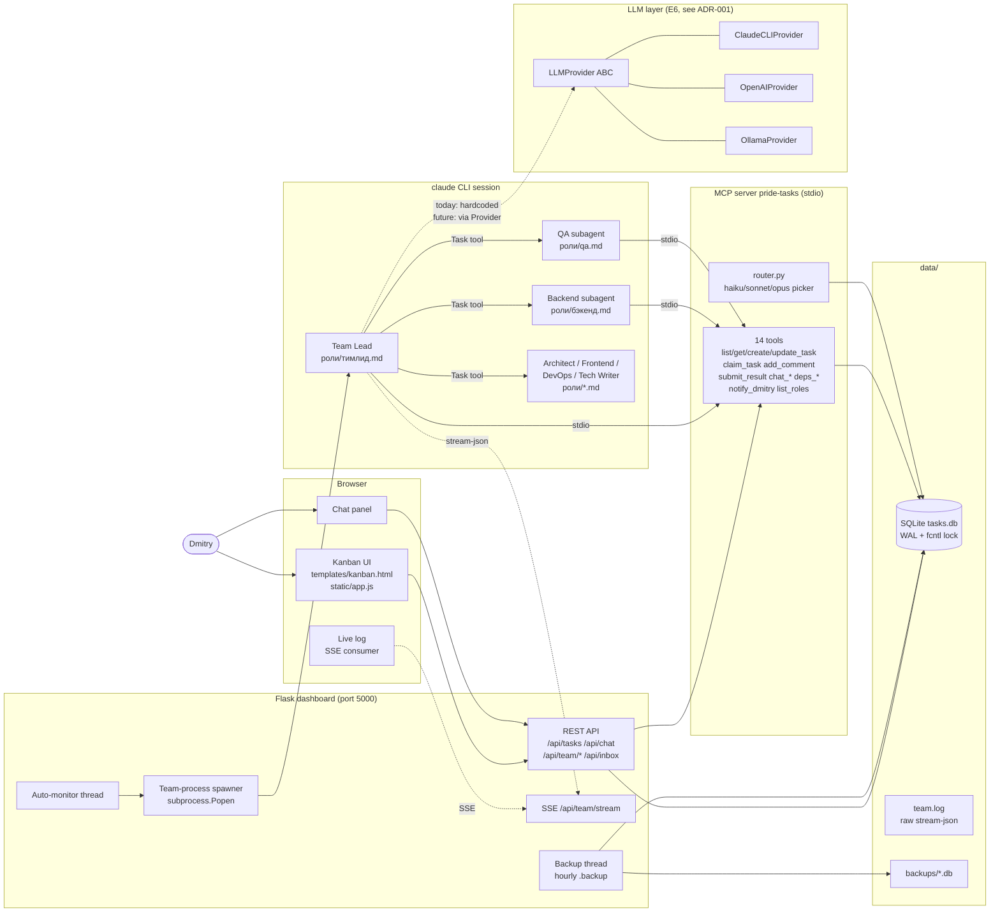
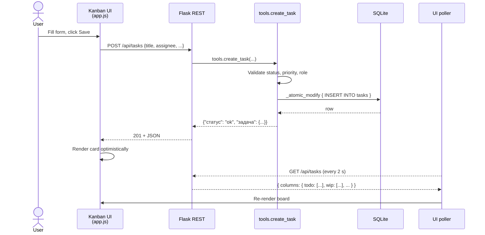
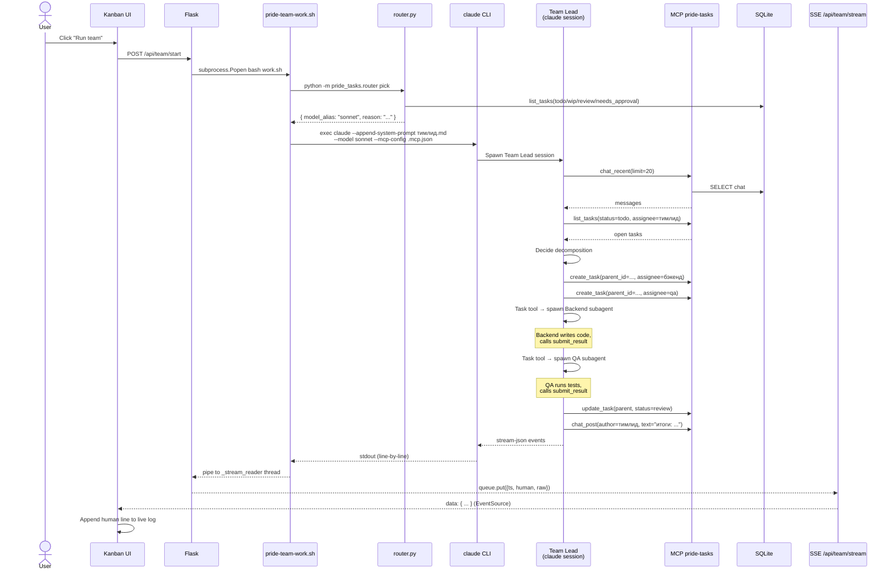
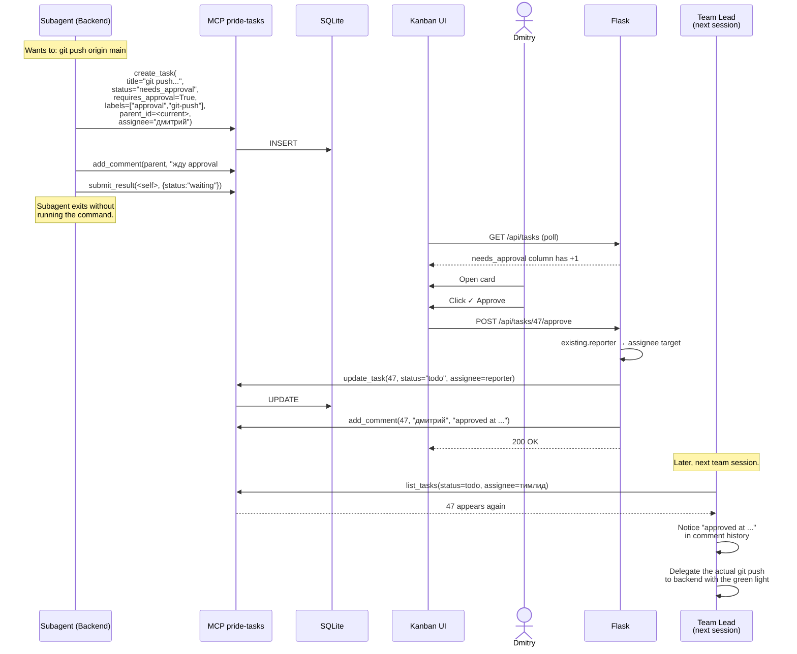

# Architecture

> How **pride-team** is wired together: processes, data, and the three flows that matter.

This document is for contributors who want to fix a bug, add a role, or plug in a new LLM provider. If you only want to *use* the project, start with [README.md](README.md).

---

## 1. Overview

**pride-team** is a local kanban for AI dev teams. A small fleet of role-bots — Team Lead, Backend, QA, plus optional Architect / Frontend / DevOps / Tech Writer — pulls work from a SQLite kanban, writes code, and hands results back for human approval. The whole stack runs on one laptop.

### Tech stack

| Layer | Tech | Why |
|---|---|---|
| Dashboard | Flask 3 + vanilla JS + Server-Sent Events | Zero build step, one process, opens in any browser |
| Persistence | SQLite (WAL) + `fcntl` file-lock + `BEGIN IMMEDIATE` | Atomic writes, readable with `sqlite3` CLI |
| Tool layer | MCP server `pride-tasks` (stdio) via `FastMCP` | Same 14 tools usable from agents and from Flask via direct import |
| Agent runtime | `claude` CLI in `--print --output-format stream-json` mode | Headless, MCP-ready, stream parsable by SSE |
| Model selection | Algorithmic router (`pride_tasks.router`) — no LLM, no tokens | Cheaper model when the queue is trivial, Opus when it's architectural |
| Future providers | OpenAI / Ollama via `LLMProvider` abstraction (E6, see [ADR-001](docs/adr/0001-llm-provider.md)) | Drop-in alternatives, no claude-CLI dependency |

### Process layout

There are **two** long-running processes plus one short-lived per session:

```text
┌──────────────────┐      ┌──────────────────┐      ┌──────────────────┐
│ Flask dashboard  │      │  claude CLI      │      │ MCP pride-tasks  │
│  app.py (5000)   │─────▶│  (per session)   │─────▶│  stdio server    │
│  + SSE /stream   │ spawn│  Team Lead role  │ stdio│  14 tools        │
└────────┬─────────┘      └────────┬─────────┘      └────────┬─────────┘
         │                         │                         │
         └─────────────────────────┴─────────────────────────┘
                                   │
                            data/tasks.db
                          (SQLite, single file)
```

- The dashboard is the only thing the user opens.
- The `claude` CLI runs only while a Team Lead session is active. The dashboard `subprocess.Popen`s it and streams stdout into the kanban via SSE.
- The MCP server is launched as a stdio child by the `claude` CLI itself, configured via `.mcp.json`. It is **not** an HTTP service.

---

## 2. Component diagram

Rendered as GitHub-flavoured Mermaid:



### Key edges, in plain English

- **User → Kanban → REST → DB.** Creating a task is a single `POST /api/tasks` that lands in `tasks.db` via `tools.create_task`.
- **REST → Spawner → claude CLI.** Clicking *Run team* spawns one `claude --print` process with the Team Lead system prompt.
- **claude CLI → MCP stdio.** The Team Lead and every subagent reach the kanban only through MCP tools — not via the REST API. The MCP server reads/writes the same `tasks.db`.
- **claude CLI → SSE → Live log.** Stream-json events are parsed by `_format_stream_event` in `app.py`, pushed into a `Queue`, and flushed to the browser via Server-Sent Events.
- **Backup thread.** Runs hourly inside the Flask process. Uses `sqlite3 .backup`, safe under WAL.
- **Auto-monitor thread.** When "auto mode" is on, polls every 10 s and restarts the Team Lead if the kanban still has open work (rate-limited to 20 sessions / hour).

---

## 3. Data model

One SQLite file: `data/tasks.db`. Five tables.

### `tasks`

The kanban. Every card is one row.

| Column | Type | Notes |
|---|---|---|
| `id` | TEXT PK | 12-char uuid hex |
| `title` | TEXT | Short label shown on the card |
| `description` | TEXT | Markdown body |
| `status` | TEXT | `todo` \| `wip` \| `needs_approval` \| `review` \| `done` \| `blocked` |
| `assignee` | TEXT | One of `тимлид` / `бэкенд` / `qa` / `архитектор` / `frontend` / `devops` / `техписатель` / `дмитрий` |
| `reporter` | TEXT | Who created it (defaults to `дмитрий`) |
| `priority` | TEXT | `P0` … `P3` |
| `labels` | TEXT | JSON array — used for `approval`, `destructive`, `design`, `adr`, etc. |
| `parent_id` | TEXT FK→tasks.id | Subtasks point to the parent epic |
| `requires_approval` | INTEGER | 0/1 — companion to `needs_approval` status |
| `created_at` / `updated_at` | INTEGER (unix s) | |
| `due_at` / `completed_at` | INTEGER | Nullable |
| `result` | TEXT | JSON dict written by `submit_result` |

Indexes: `status`, `assignee`, `parent_id`.

### `task_comments`

Append-only history per card. Each `add_comment` MCP call appends one row. The dashboard renders these as the timeline on the task detail view.

| Column | Type | Notes |
|---|---|---|
| `id` | INTEGER PK | autoincrement |
| `task_id` | TEXT FK | |
| `author` | TEXT | One of the role names |
| `text` | TEXT | Plain text |
| `created_at` | INTEGER | |

### `task_dependencies`

Adjacency list — "task A waits for task B".

| Column | Type | Notes |
|---|---|---|
| `task_id` | TEXT | The one that waits |
| `depends_on` | TEXT | The blocker |
| `created_at` | INTEGER | |

Self-dependencies are rejected by a `CHECK` constraint; cycles are rejected in application code (`db.add_dependency`).

### `chat_messages`

A single chat thread between Dmitry and the agents. Not per-task — this is the cross-cutting room.

| Column | Type | Notes |
|---|---|---|
| `id` | INTEGER PK | |
| `author` | TEXT | One of: `дмитрий`, `тимлид`, `бэкенд`, `qa`, `system` |
| `text` | TEXT | |
| `created_at` | INTEGER | |

The Team Lead reads this at the start of every session (`chat_recent`) and replies via `chat_post` before touching tasks.

### `claude_sessions`

Telemetry. Written by `_record_session_from_result` when the claude CLI emits its final `result` event.

| Column | Type | Notes |
|---|---|---|
| `id` | INTEGER PK | |
| `started_at` / `finished_at` | INTEGER | |
| `duration_ms`, `num_turns` | INTEGER | |
| `input_tokens`, `output_tokens` | INTEGER | Real input = `input + cache_creation + cache_read` |
| `total_cost_usd` | REAL | |
| `model` | TEXT | The model that did most of the work (max `costUSD`) |
| `is_error` | INTEGER | 0/1 |

Surfaced by `/api/usage` and shown in the dashboard header.

### `roles`

Mostly static — name, description, capabilities (JSON array). Used by the *Roles* page in the UI; agents don't depend on it (their identity comes from a file in `роли/`).

### Write safety

Every write goes through `db._atomic_modify`, which:

1. Acquires an exclusive `fcntl.flock` on `data/tasks.db.lock`.
2. Opens a connection with `BEGIN IMMEDIATE` (SQLite reserved lock).
3. Runs the mutation.
4. Commits, releases both locks.

Tested with eight concurrent writers — no lost updates, no `database is locked` errors.

---

## 4. Flow 1 — Creating a task

Goal: a user clicks **+ New task**, fills the form, hits save, and sees the card appear in **TO DO**.



**Steps in detail:**

1. **Browser submits the form.** `static/app.js` collects `title`, `description`, `assignee`, `priority`, `labels`, and POSTs to `/api/tasks`.
2. **Flask routes to `api_create_task`** (in `дашборд/app.py`). It calls `tools.create_task` from the MCP package — same code path that MCP agents use.
3. **`tools.create_task` validates inputs.** Unknown status / priority / role return `{"статус": "error", "причина": "..."}` and Flask responds 400. No DB write happens.
4. **`db.insert_task` writes under a lock.** Generates a 12-hex id, sets `created_at = updated_at = now`, stores `labels` as JSON. Default status is `todo`.
5. **Flask returns 201** with the new row. The UI shows the card immediately (optimistic render).
6. **The UI poller (`GET /api/tasks` every 2 s) reconciles.** Final source of truth is the server response. Tasks older than 7 days in `done` get folded into the *Archive* group.

There is **no WebSocket for kanban changes** — only for the live log. The board uses lightweight polling to keep the dashboard portable to any browser.

---

## 5. Flow 2 — Running the team

Goal: the user clicks **▶ Run team**. The Team Lead picks up open tasks, decomposes them, delegates to Backend / QA, and streams its thinking back into the UI.



**Steps in detail:**

1. **`POST /api/team/start`** calls `_start_team_process`. It guards against double-start with a lock and returns `409` if a session is already running.
2. **`pride-team-work.sh` runs the router first.** `pride_tasks.router.pick_from_db` reads open tasks, classifies them by keywords (architectural / trivial / techwrite / devops / other), and picks `haiku`, `sonnet`, or `opus`. The decision is logged to stdout so the user sees the *why*.
3. **`claude` CLI launches in `--print` mode** with `--append-system-prompt = роли/тимлид.md`, `--mcp-config .mcp.json`, `--permission-mode bypassPermissions`, and `--output-format stream-json`.
4. **The Team Lead starts every session with the chat.** `chat_recent` → reply via `chat_post` if there are unread messages from Dmitry. *Then* it reads the kanban.
5. **Decomposition.** For each new top-level task the Team Lead calls `create_task(parent_id=..., assignee=...)` 2–6 times.
6. **Delegation via the Task tool.** The Team Lead spawns subagents with `subagent_type="general-purpose"`, passing the relevant `роли/*.md` as the system prompt plus the subtask id.
7. **Subagents work in parallel.** Each subagent has its own MCP connection. Backend writes code with Read/Write/Edit, QA runs tests with Bash, both call `submit_result` when done.
8. **Stream parsing.** `_format_stream_event` in `app.py` converts each line of `stream-json` into a human-readable string (`📝 Создаёт задачу...`, `👥 Делегирует бэкенду...`). The raw line is also written to `data/team.log` for forensic debugging.
9. **SSE fan-out.** Every connected browser opens `/api/team/stream`. Events are dequeued from `_team_state["queue"]` and emitted as `data: {...}` frames.
10. **Session telemetry.** When the final `result` event arrives, `_record_session_from_result` writes one row into `claude_sessions` with tokens, cost, model, and duration. The dashboard header shows the rolling totals.

If the user enables **auto mode** (`POST /api/team/auto {enabled: true}`), `_auto_monitor_loop` restarts step 1 every time a session ends and there are still open Team Lead tasks — capped at 20 sessions/hour and ≥30 s between restarts.

---

## 6. Flow 3 — Approval gate

Goal: a subagent wants to do something risky (`git push`, `ssh`, `systemctl restart`). It must **not** execute the command. Instead it creates an `needs_approval` task, freezes, and waits for Dmitry to click **Approve** or **Reject** in the dashboard.



**Steps in detail:**

1. **The subagent never runs the risky command directly.** Its system prompt (`роли/бэкенд.md`, `роли/devops.md`) lists the approval-gated operations. See [approval_gates.md](approval_gates.md) for the full list.
2. **The subagent creates a `needs_approval` task** with `requires_approval=True`, `labels=["approval", "<kind>"]`, and `parent_id` set to the current parent. The description spells out *what* command will run, *why*, and *what files / tests* are affected.
3. **The subagent freezes.** It comments on the parent task ("waiting on #47") and exits. No further work happens until Dmitry decides.
4. **The dashboard surfaces it.** The **NEEDS APPROVAL ⚠** column shows the card with a destructive-label highlight. `/api/inbox` aggregates it into the user's Inbox count.
5. **Dmitry opens the card** and reads the description. He clicks **Approve** or **Reject**.
6. **`POST /api/tasks/<id>/approve`** moves the task to `status=todo` (not `wip` — work hasn't started yet) and reassigns it back to the *reporter* (i.e. the subagent's parent — usually the Team Lead). It also appends an `approved at ...` comment.
7. **`POST /api/tasks/<id>/reject`** moves the task to `status=done` with a `REJECTED: <reason>` comment. The subagent's parent will see this and abandon the operation.
8. **The next Team Lead session** finds the now-approved task in its queue, sees the approval comment, and delegates the actual command to a subagent with the green light. The subagent runs the command and reports back.

This pattern keeps the agent loop **pure-data** — no escape hatches, no special tools that bypass approval. The only thing Dmitry has to trust is the `roles/*.md` prompts and the small list of approval-gated operations in `approval_gates.md`.

---

## 7. Extension points

Three things you'll plausibly want to add. The code is organized so each is a one- or two-file change.

### 7.1. Add a new role

A role is **a markdown file in [`роли/`](роли/)**. That's it. No code changes.

1. Copy an existing prompt as a starting point (`роли/бэкенд.md` is a good template for code-writing roles, `роли/qa.md` for testing roles, `роли/техписатель.md` for docs).
2. Edit the frontmatter (`роль:`, `описание_короткое:`).
3. Write the system prompt. Sections that matter: *Specialization*, *Tools you have*, *What NOT to touch*, *Communication discipline*, *Algorithm*, *Completion*.
4. Add the new role name to `ROLES` in [`mcp_сервер/pride_tasks/models.py`](mcp_сервер/pride_tasks/models.py) so it passes validation.
5. (Optional) Insert a row into the `roles` table so it shows up on the *Roles* page in the UI.

The Team Lead picks up the new role automatically — `Task` invocations look up the role by name in the prompt text.

### 7.2. Add a new LLM provider

Read [ADR-001](docs/adr/0001-llm-provider.md) first. The migration to a pluggable `LLMProvider` is tracked in epic **E6**. Today the Team Lead hard-codes `claude --model ...`; tomorrow it will go through:

```python
provider = create_provider(role_frontmatter)  # llm: claude | openai | ollama
response = await provider.invoke(messages, tools=...)
```

To add a fourth provider (e.g. Bedrock) once E6 lands:

1. Implement `LLMProvider` in `llm/<name>.py` with `invoke` and `stream`.
2. Map your provider's request/response into the Anthropic-style `Message` / `LLMResponse` (§2.2 of the ADR).
3. Register in `create_provider`.
4. Add a smoke test under `mcp_сервер/tests/` (or wherever `llm/tests/` lands).

For tool-calling on providers without native tool support (Ollama), the bridge converts MCP tools into a JSON protocol injected via the system prompt — see ADR-001 §6.1.

### 7.3. Add a new MCP tool

The MCP server is small and explicit. To add a tool:

1. Implement the logic in [`mcp_сервер/pride_tasks/tools.py`](mcp_сервер/pride_tasks/tools.py) as a `dict`-in / `dict`-out function (always return `{"статус": "ok" | "error" | ...}`).
2. Add the DB layer in [`mcp_сервер/pride_tasks/db.py`](mcp_сервер/pride_tasks/db.py) — wrap mutations in `_atomic_modify`.
3. Register the tool in [`mcp_сервер/pride_tasks/server.py`](mcp_сервер/pride_tasks/server.py) with `@mcp.tool()`. The docstring becomes the tool's description visible to the agent.
4. If the dashboard needs a REST endpoint over it, add a route in `дашборд/app.py` that calls the same `tools.<fn>(...)` — never duplicate the logic.
5. Add a test under `mcp_сервер/tests/`.

Tools are pure functions of `(args, db_path) → dict`. Agents and the dashboard share them. There is no "internal" vs "external" API.

### 7.4. Add a new dashboard route

`дашборд/app.py` is a single Flask file with one `create_app` factory. Add the route, call the matching `tools.<fn>`, return `jsonify(...)`. Front-end JS lives in `дашборд/static/app.js` and is unbundled — edit and refresh.

---

## 8. ADR index

Architecture decisions live in [`docs/adr/`](docs/adr/). One Markdown file per decision, numbered, status tracked in the header.

| ID | Title | Status | Date |
|---|---|---|---|
| [ADR-001](docs/adr/0001-llm-provider.md) | `LLMProvider` interface — Anthropic-style messages, lazy SDKs, MCP bridge inside providers | Accepted | 2026-05-21 |
| ADR-002 | Role-prompt frontmatter format (`llm`, `model`, `temperature`) — *coming with E6.6* | Draft | — |

The ADR template is short on purpose: Context → Decision → Consequences → Alternatives → Implementation plan → Open questions → References. See ADR-001 for the canonical example.

---

## Appendix — File map

```text
команда/
├── README.md, README.ru.md, NOTICE, LICENSE
├── ARCHITECTURE.md            ← you are here
├── approval_gates.md          ← the risky-ops list (Flow 3)
├── .mcp.json                  ← claude CLI ↔ MCP server wiring
├── docs/
│   ├── adr/0001-llm-provider.md
│   └── launch/                ← OS-specific launcher docs
├── роли/                      ← role system prompts (one per role)
│   ├── тимлид.md  бэкенд.md  qa.md  архитектор.md
│   └── frontend.md  devops.md  техписатель.md
├── mcp_сервер/pride_tasks/    ← MCP server
│   ├── server.py              ← @mcp.tool() registrations
│   ├── tools.py               ← 14 tool implementations
│   ├── db.py                  ← SQLite layer + locking
│   ├── router.py              ← model picker (haiku/sonnet/opus)
│   ├── alerts.py              ← Telegram notifier
│   └── models.py              ← ROLES, STATUSES, PRIORITIES constants
├── дашборд/                   ← Flask app
│   ├── app.py                 ← all REST + SSE + spawner + auto-monitor
│   ├── templates/kanban.html
│   └── static/{app.js,style.css}
├── команды/                   ← shell launchers
│   ├── pride-team-start.sh    ← starts the dashboard
│   ├── pride-team-work.sh     ← spawned per Team Lead session
│   └── *.ps1                  ← Windows equivalents
└── data/
    ├── tasks.db               ← the only state
    ├── tasks.db.lock          ← fcntl mutex
    ├── team.log               ← raw stream-json for every session
    ├── team.pid, dashboard.pid
    └── backups/               ← hourly SQLite .backup snapshots
```

---

**License:** [MIT](LICENSE). Contributions: see [CONTRIBUTING.md](CONTRIBUTING.md) (added in **E4.2**).
