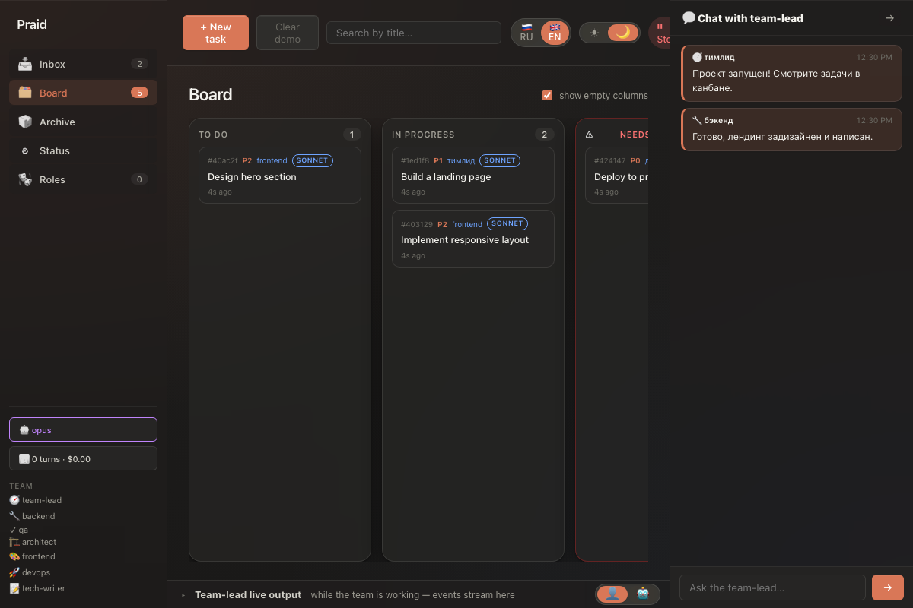
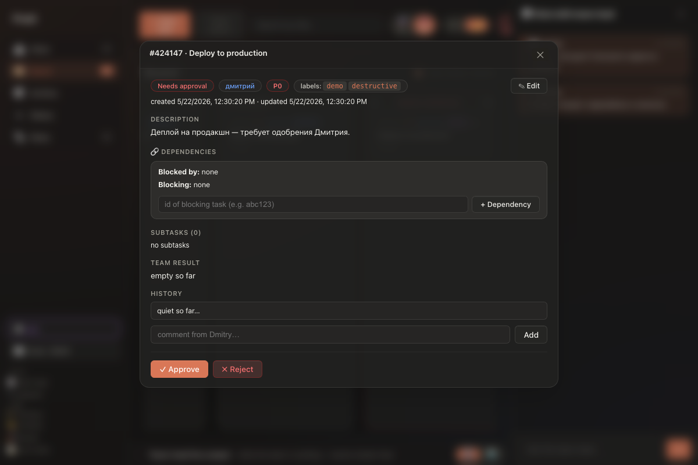
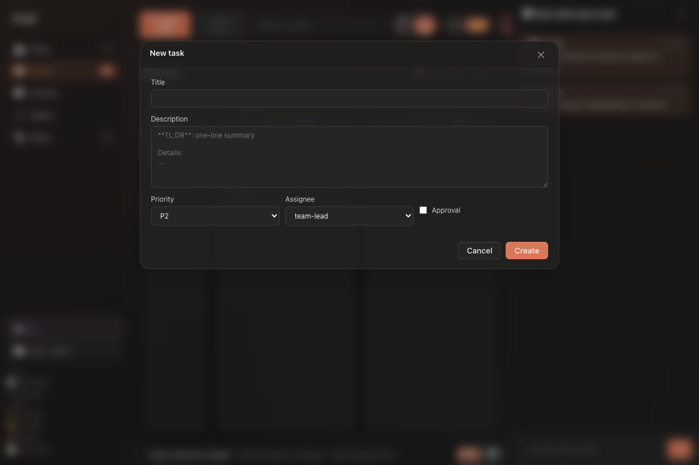

# devboard

> An AI dev team in your kanban.

[](#)
[](LICENSE)
[](https://www.python.org/downloads/)
[](#)

Three role-bots — **Team Lead**, **Backend**, **QA** — share one local kanban and ship real code while you watch the board. You write the task; they pick it up, decompose it, write the code, run the tests, and hand it back for approval.

<!-- video demo will go here after E9 -->


## Why

Most coding agents run as a single loop in your terminal. `devboard` runs as a **small org**: a Team Lead splits work, delegates to specialists, reviews their results, and only escalates to you when it actually matters. Everything lives in a SQLite kanban you can read with `sqlite3` and see in a Flask dashboard.

Built for solo developers who want agent-driven delivery without giving up the board, the audit trail, or the approval gates.

## Features

- **Kanban board** — tasks move through TO DO → WIP → NEEDS APPROVAL → REVIEW → DONE. You approve risky operations; agents handle the rest.
- **Live log** — stream-json from the Claude session is parsed into human-readable lines and pushed to the browser via SSE.
- **Approval gates** — `git push`, `ssh`, `systemctl restart`, and other risky operations require explicit user approval before any agent runs them.
- **Model router** — picks `haiku`, `sonnet`, or `opus` based on task complexity. No tokens wasted on routing.
- **Settings tab** — configure language, teamlead mode, and model preferences in-dashboard. No manual `.env` edits needed for common options.
- **Statistics tab** — task throughput, team velocity, and role performance analytics, all from the same SQLite data.
- **Dual-language i18n** — both the dashboard UI and agent output switch between RU and EN. One toggle covers everything.
- **Plain-language mode** — the Team Lead simplifies its output for non-technical product owners. Toggle in Settings; no prompt editing required.
- **Multi-role team** — Team Lead, Backend, QA ship by default. Architect, Frontend, DevOps, and Tech Writer roles are drop-in extras.

## Quickstart

**Requirements:** Python 3.11+, an Anthropic subscription with `claude` CLI installed.

### Option A — double-click (Mac / Linux / Windows)

```text
Запустить devboard.command   # macOS / Linux (double-click in Finder)
Запустить devboard.bat       # Windows       (double-click in Explorer)
```

The launcher installs dependencies on first run, starts the Flask dashboard, and opens `http://127.0.0.1:4999` in your browser.

### Option B — shell

```bash
git clone https://github.com/rdm9x/devboard.git
cd devboard
python3 setup.py            # one-time: creates venvs, installs deps
./команды/devboard-start.sh
open http://127.0.0.1:4999
```

### Option C — Docker

```bash
cp .env.example .env
# edit .env, set ANTHROPIC_API_KEY (or OPENAI_API_KEY / OLLAMA_URL)
docker compose up -d
open http://localhost:4999
```

Data lives in `./data` (bind-mounted into the container) and survives
restarts. See [DEPLOYMENT.md](DEPLOYMENT.md) for a full VPS guide.

Once the dashboard is up:

1. Click **+ New task**, fill the form, save — the task lands in **TO DO**.
2. Click **▶ Run team** in the header. The Team Lead picks up the task, decomposes it, delegates subtasks to Backend and QA, and streams live output to the bottom panel.
3. When a task moves to **REVIEW**, open the card and click **Accept** or **Send back**.
4. When you see a task in **NEEDS APPROVAL ⚠**, open it, read what the agent wants to do, and click **Approve** or **Reject**.

## Screenshots

<p align="center">
  
  
</p>
<p align="center">
  
  
</p>

## Roles

Each role lives as a system prompt in [`роли/`](роли/):

| File | Role | Tools |
|---|---|---|
| `роли/тимлид.md` | Team Lead — plans, decomposes, reviews, escalates | MCP `pride-tasks` + Task (subagents) + Read / Bash / Edit |
| `роли/бэкенд.md` | Backend — writes code, unit tests | Read / Write / Edit, Bash, MCP `pride-tasks` (read + comment + submit) |
| `роли/qa.md` | QA — runs tests, finds regressions, writes new tests | Read, Bash, MCP `pride-tasks` |
| `роли/архитектор.md` | Architect (optional) | Read, MCP `pride-tasks` |
| `роли/frontend.md` | Frontend (optional) | Read / Write / Edit, Bash |
| `роли/devops.md` | DevOps (optional) | Read, Bash, approval-gated shell |
| `роли/техписатель.md` | Tech Writer (optional) | Read / Write / Edit on docs only |

Architecture details live in [ARCHITECTURE.md](ARCHITECTURE.md) (added in **E4.3**).

## Configuration

Language, teamlead mode, and model preference can be changed in the **Settings tab** inside the dashboard — no file editing needed for common options.

For lower-level setup, set these in `.env` or your shell before launching.

| Variable | Required | Default | Purpose |
|---|---|---|---|
| `ANTHROPIC_API_KEY` | yes | — | Auth for the Team Lead and subagents. Subscription tokens via `claude` CLI also work. |
| `PRIDE_DASHBOARD_PORT` | no | `4999` | Flask dashboard port. |
| `PRIDE_DB_PATH` | no | `data/tasks.db` | SQLite kanban location. |
| `OPENAI_API_KEY` | no | — | Optional fallback model for cost-sensitive subtasks. |
| `OLLAMA_URL` | no | — | Optional local model endpoint, e.g. `http://localhost:11434`. |
| `CLAUDE_MODEL` | no | `opus` | Model for the Team Lead. |

## Architecture at a glance

```text
You ── kanban form ──► Flask dashboard ── SQLite (tasks.db) ◄── MCP `pride-tasks`
                                              ▲
                                              │ live log (SSE)
                                              │
                            claude -p  ──► Team Lead
                                              │ Task tool
                                              ├──► Backend subagent
                                              └──► QA subagent
```

- **Atomic writes:** `fcntl` lock + SQLite `BEGIN IMMEDIATE`. Eight concurrent writers tested.
- **MCP server** runs as a stdio process inside the Claude session, configured via `.mcp.json`.
- **Approval gates** (`git push`, `ssh`, `systemctl restart`, etc.) require explicit user approval — see [approval_gates.md](approval_gates.md).

## Roadmap

- **E1** — MCP server `pride-tasks` (done)
- **E2** — Flask dashboard + live log (done)
- **E3** — Approval-gate workflow (done)
- **E4** — Documentation pass (in progress — this README is **E4.1**)
- **E5** — `docker-compose` packaging
- **E6** — CI / GitHub Actions
- **E7** — Multi-model fallback (OpenAI, Ollama)
- **E8** — Bitrix24 bridge → `pride-dev-department`
- **E9** — Video demo + landing page

## Contributing

PRs welcome — see [CONTRIBUTING.md](CONTRIBUTING.md) (added in **E4.2**).

## License

[MIT](LICENSE) © 2026 owner.
