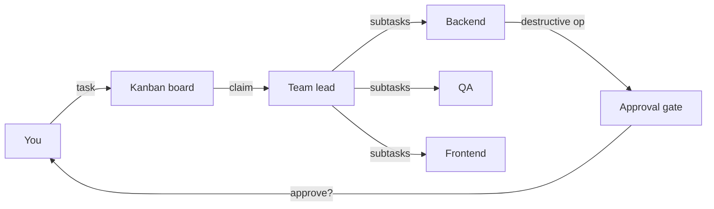

# Building an AI team in a kanban (and why one chatbot wasn't enough)

I have a folder on my laptop called `chats-i-gave-up-on/`. It holds maybe forty exported transcripts from coding sessions that started bright and ended in a swamp. They all follow the same shape: a clear first prompt, ten useful turns, then a slow drift where the model forgets what we agreed on in turn three and by turn forty I'm copying snippets by hand because it's faster than arguing.

The models aren't bad — they got dramatically better while I was writing those transcripts. What didn't get better was the shape of the conversation: one window, one role, one growing context, one human trying to be product manager, architect, reviewer, and operator at once. The bottleneck stopped being the model and started being me.

`pride-team` is what I built once I admitted that. It's a local web kanban where each card is picked up by a separate Claude session running a specific role — team lead, backend, QA, architect, frontend, devops, tech writer — and anything destructive (a `git push`, an `ssh`, a `DROP TABLE`) stops at an approval gate so I can read the diff first. This post is the long version of why each choice is the way it is, what didn't work, and where the tradeoffs sting.

## The problem with one big chatbot

The first thing that breaks in a long session is focus. Context windows are huge now, but attention inside the window isn't uniform — facts established early get statistically louder than recent corrections. I'd tell the model "we're using SQLite, not Postgres" in turn three and by turn fifty it would casually suggest a `pg_dump` for backups. The context isn't lost, it's diluted.

The second is role-mixing. A single prompt is asked to be the architect choosing the abstraction, the engineer writing it, the tester checking it, and the ops person deploying it. Each benefits from a different stance: the architect should push back on premature implementation, the engineer should ship, the tester should be suspicious, the ops person should be paranoid. Cramming all four into one persona makes each mediocre.

The third is safety. The two answers I see in the wild are "manual approval for every shell call" and "give it the keys, what could go wrong." The first is exhausting and you start auto-clicking; the second is how you end up with a tool that politely tells you it rewrote 47 files to fix the typo you asked about. I let an agent do exactly that once. It was technically correct. I still spent the next hour reading the diff.

The fourth — the one I felt most — is no parallelism. While the model writes tests, you wait. While it writes the frontend, you wait. There's no "the backend person is on the API while the frontend person mocks the form" because there's only one person.

## What I actually built

A Flask app on `127.0.0.1:5000` backed by a SQLite file. Five columns — Inbox, Todo, WIP, Review, Done. You add a task, hit "Run team", and a Claude session boots up with the `team lead` role prompt. It reads the card, decomposes into subtasks, creates child cards, and dispatches to other roles. Each subtask gets its own Claude session loaded with the matching role markdown.

The roles talk through an MCP server called `pride-tasks` that exposes the kanban as a set of tools — `list_tasks`, `claim_task`, `add_comment`, `submit_result`, `chat_post`, a handful more. From the agents' point of view the kanban is another tool channel. From mine, it's a source of truth I can open in a browser or read with `sqlite3`.

Anything that touches the outside world — git pushes, ssh, package installs, schema changes — gets intercepted by an approval gate. The agent doesn't run the command; it creates a needs-approval card with the exact command, the rationale, and (where relevant) the diff. I click Approve or Reject and the agent moves on.



The picture is deliberately boring. Nothing here is new on its own — kanban boards, role prompts, MCP, approval flows have all been written about. What's interesting, to me, is the combination: roles you can read in 60 seconds, a board you can read in five, and a hard stop before anything irreversible.

## Technical choices (and why)

**Why SQLite, not Postgres.** Single-user local tool. SQLite gives me a file I can copy as a backup, a database I can open with the standard CLI, no daemon, no network surface to secure. With a `BEGIN IMMEDIATE` and an `fcntl` lock around writes, eight concurrent agents behave fine. Tradeoff: no multi-user story. The day two humans want to share a board, this becomes a Postgres conversation.

**Why Flask, not FastAPI.** The dashboard is server-rendered HTML with a sprinkle of Server-Sent Events for the live log. Jinja templates are easier to read and modify than a React app, and at this scale "easier to modify" beats "more scalable." FastAPI's async would matter at thousands of concurrent users; I have one. Tradeoff: interactive UI later will be more painful than if I'd gone React-first.

**Why MCP for inter-agent communication.** The agents need a shared channel and I did not want to invent a protocol. MCP is a tool channel with a stable schema, decent client support in Claude, and a small enough surface to read the spec in one sitting. Tradeoff: MCP works natively in the Claude CLI but needs a bridge for OpenAI and Ollama — something I had to design around.

**Why one role = one Markdown file.** Every role lives at `роли/<name>.md` with frontmatter at the top. That file is simultaneously the system prompt, the config (tools, model, provider), and the documentation. You can read, edit, fork, share it. No DB lookup, no GUI form, no migration. Tradeoff: no validation beyond "did the agent behave reasonably" — a malformed prompt won't fail at startup, it'll fail in production. A small frontmatter check at load time was good enough.

**Why a team lead instead of a flat pool of workers.** I tried both. Flat pools end in chaos within a few cards: two agents claim the same task, three disagree about what it even means, nobody owns the integration. A lead that reads the brief, decomposes, and dispatches is less exciting and more reliable. Tradeoff: the lead is a serial bottleneck for planning. Planning is supposed to be a bottleneck.

## Multi-LLM via the LLMProvider abstraction

Right now agents run on the Claude CLI. The next step (ADR-001 in the repo) is an `LLMProvider` abstraction so you can point a role at OpenAI or Ollama without touching anything else.

The interface is small on purpose:

```python
class LLMProvider(ABC):
    async def invoke(self, messages, tools=None, system_prompt=None) -> LLMResponse: ...
    async def stream(self, messages, tools=None, system_prompt=None) -> AsyncIterator[LLMChunk]: ...
```

The message and content-block shape is borrowed directly from Anthropic — `TextBlock`, `ToolUseBlock`, `ToolResultBlock`. Not out of loyalty: Anthropic's format lets a single assistant message hold text and a tool call side by side; OpenAI's puts tool calls in a sibling field and needs a separate `role=tool` message for results. Anthropic → OpenAI is a clean mechanical conversion; the other way is lossy. Picking the strictly more expressive format means the abstraction doesn't quietly drop information when you switch providers.

A role chooses its provider in frontmatter — `llm: claude | openai | ollama`. If unspecified, the factory auto-detects from env: `ANTHROPIC_API_KEY` → Claude, `OPENAI_API_KEY` → OpenAI, a reachable Ollama → local model, otherwise fail loudly. Provider choice is per-role, so it's reasonable to run the lead on a strong model and the QA loop on a cheap one — which is most of the point.

The biggest tradeoff is MCP. It works natively on Claude and has to be bridged for the others — the bridge describes MCP tools as JSON Schemas in the system prompt and parses tool-call JSON back out of the model's text. Less elegant than native tool-calling. It works.

## Configurable roles — roles/*.md and a marketplace v0

A role file looks roughly like this:

```yaml
---
type: role_prompt
role: backend
project: pride-team
llm: claude
model: opus
tools: [Read, Write, Edit, Bash, mcp__pride_tasks]
---

# You are the Backend developer of the pride-team team

You work in Python, Flask, SQLite, and MCP. You don't touch the UI ...
```

The full frontmatter schema is the subject of ADR-002, but the shape above is the spine: identity fields, a model selection, an allowlist of tools, then prose. The prose is the prompt; no template engine, no DSL, no DAG. To change how the backend agent behaves, you open the file and edit English.

Out of the box the project ships seven roles. The next batch of examples — product manager, designer, security auditor, code reviewer, data analyst — will live under `roles/examples/` to copy and adapt. The marketplace v0 plan is deliberately small: roles are gists, the dashboard accepts a URL, frontmatter gets validated, the role shows up in your team. No accounts, no servers, no central registry. Fanciness can come later.

## What didn't work (lessons learned)

I tried to skip the team lead. Any worker role could claim any card, decompose inline, and delegate. Elegant on paper. In practice the first run produced two backends fighting over the same card, a QA agent decomposing a task before the backend had agreed on the design, and a frontend agent quietly inventing an API nobody had committed to. The lead is essential not because it adds capability but because it removes ambiguity about who decides.

I tried fully autonomous mode — no approval gate. First session, an agent helpfully "cleaned up the repo" by running `rm -rf` against a directory whose name it had misread. Recoverable; I lost ninety minutes. The approval gate is non-negotiable now, and the list of intercepted operations grew from "git push" to about a dozen.

I tried storing roles in the database with a small UI editor. "In the DB" sounds more serious than "in a folder." Three things broke: diffing against an older version became a SQL exercise, sharing meant exporting JSON, and editing with my real editor — syntax highlighting, vim keybindings, git history — became impossible. Moving roles back to Markdown was an unambiguous win.

I tried a message bus between agents — Redis pub/sub. Wrong mental model. Agents don't run constantly waiting for events; they run when a card is dispatched. A synchronous kanban with comments matches what's actually happening: discrete units of work, each with a state and a history. The bus added latency and concurrency bugs in exchange for capabilities I didn't need.

## What's next

Finish the multi-LLM provider work so OpenAI and Ollama are first-class. Ship a role marketplace v0 (gist URLs, validated frontmatter, no central registry). Complete the English UI — right now role files and a chunk of the dashboard speak Russian, which is a friction tax for anyone outside Russian-speaking teams. Package a `docker-compose up` story. Open a Discord and a Discussions board.

## Try it

```bash
git clone https://github.com/<user>/pride-team
cd pride-team
./Start.command   # macOS, double-click in Finder works too
# or:
docker-compose up
```

Repo: github.com/<user>/pride-team
Roadmap: see the issues tab
License: MIT.

If you try it and the team eats your codebase, tell me. If it helps you ship — also tell me. Both signals are useful.
